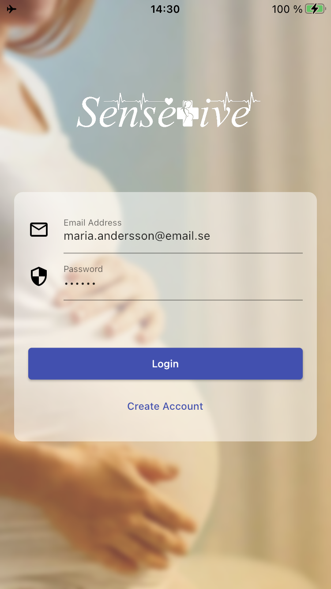
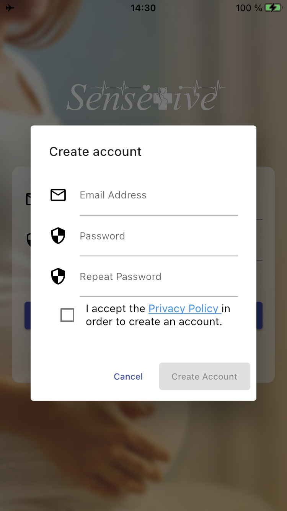
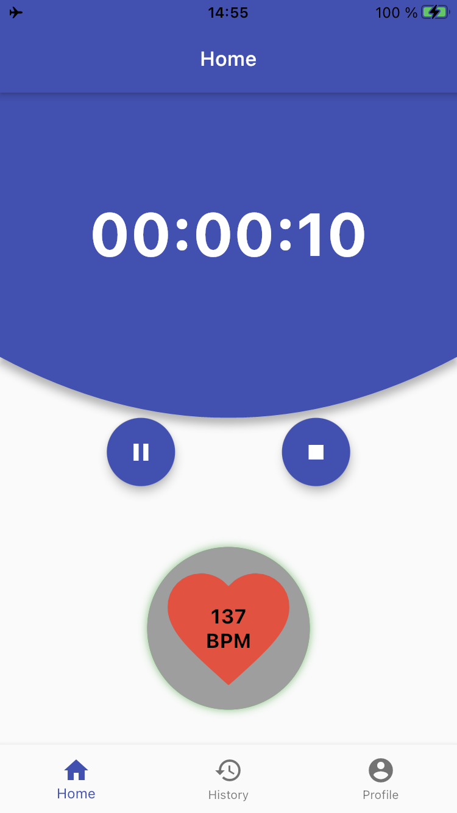
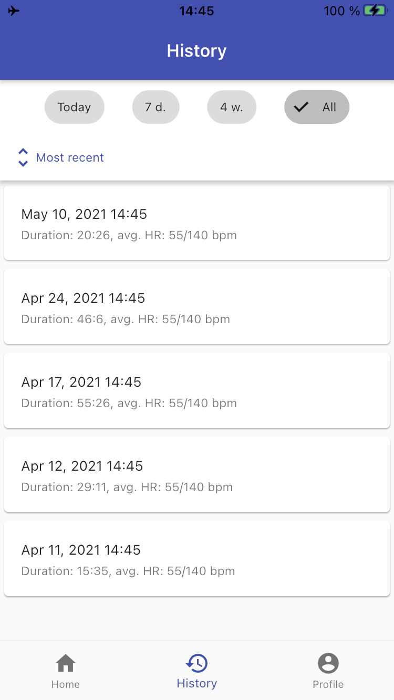
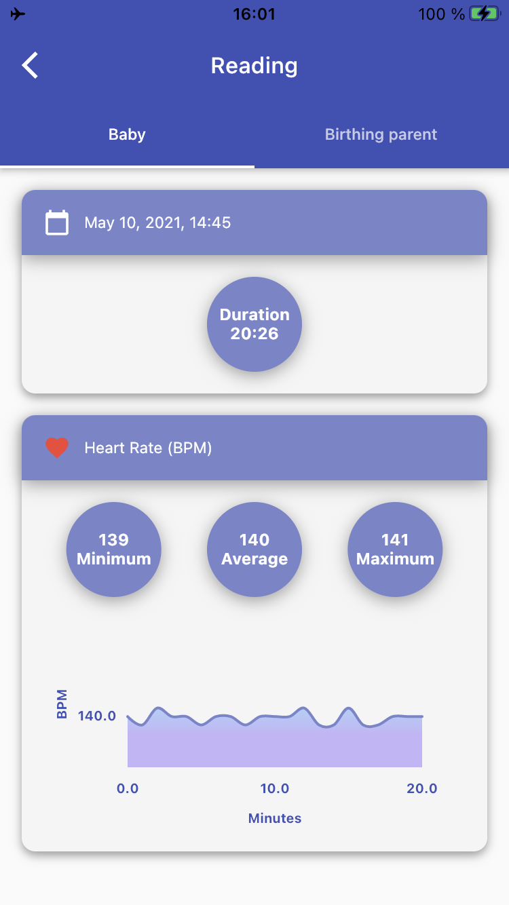
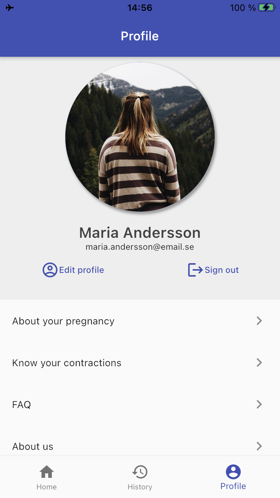

# SenseTive
A bachelor thesis project resulting in a prototype application with associated backend server for [SenseTive](http://sensetive.se), 
a monitoring system for reducing the risk of stillbirths. 

More information can be found in [thesis](http://urn.kb.se/resolve?urn=urn:nbn:se:uu:diva-444825).

# Application
The application supports authentication of the user, creating "virtual" readings, showing details of a reading
and editing the user account. The readings are "virtual" since the sensor-kit which the application co-operates
with is still under development. The application is however prepared for the integration with the sensor-kit.

## UI

   
   

  
   
   

   
   

# Server
The server consist of a Web API using REST and supports the application during authentication and storing 
user-generated data in a relational database. 

# Contributors
- asc0109
    * Measuring
- johanlovgren
    * Login
    * History
    * Profile
- rickebo
    * Backend server
