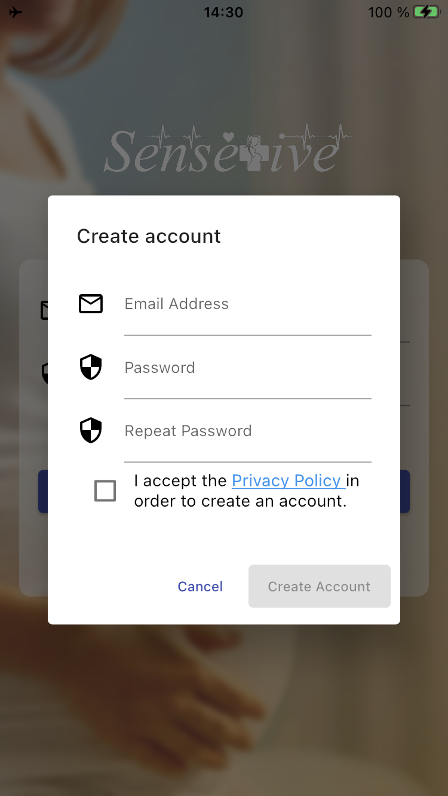
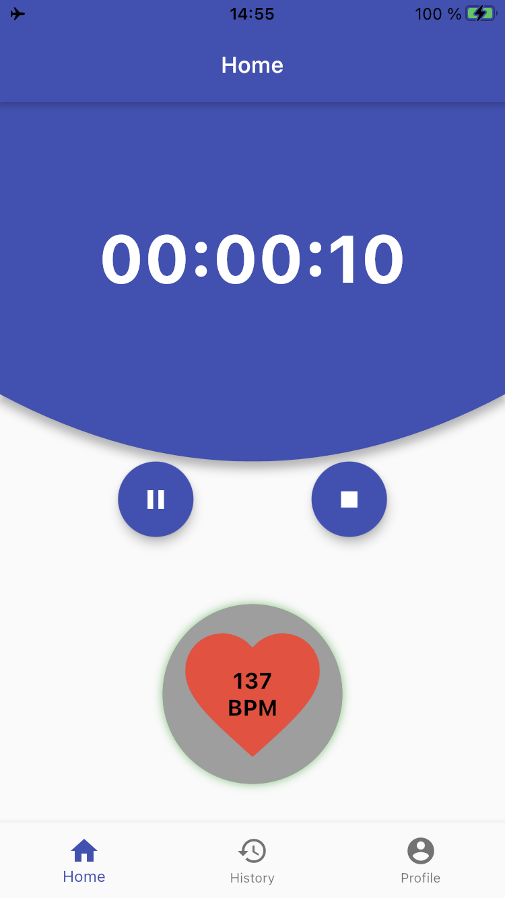

# Application

A prototype application for [SenseTive](http://sensetive.se), a monitoring system for reducing the risk of stillbirths. 

The application supports authentication of the user, creating "virtual" readings, showing details of a reading 
and editing the user account. The readings are "virtual" since the sensor-kit which the application co-operates 
with is still under development. The application is however prepared for the integration with the sensor-kit.

## UI 

## Contributors
- johanlovgren 
    * Login
    * History
    * Profile
- asc0109
    * Measuring

This project is a starting point for a Flutter application.

A few resources to get you started if this is your first Flutter project:

- [Lab: Write your first Flutter app](https://flutter.dev/docs/get-started/codelab)
- [Cookbook: Useful Flutter samples](https://flutter.dev/docs/cookbook)

For help getting started with Flutter, view our
[online documentation](https://flutter.dev/docs), which offers tutorials,
samples, guidance on mobile development, and a full API reference.
